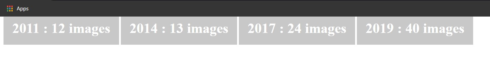
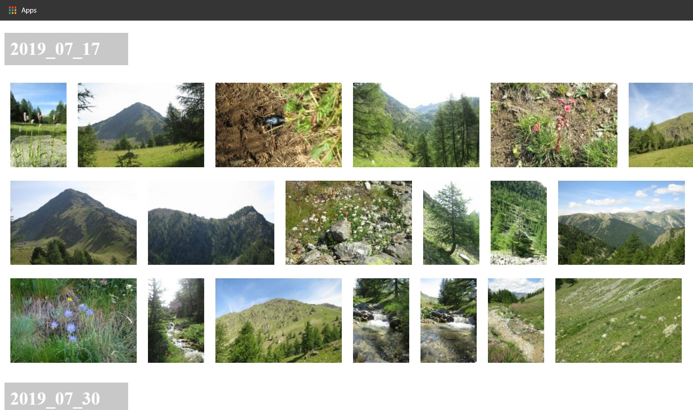

# palbum
A bash script used to create an album of photos hierarchy with an html file to browse your gallary
# Install
```bash
sudo apt install exif
sudo apt install imagemagick-6.q16       
sudo apt install imagemagick-6.q16hdri              
sudo apt install graphicsmagick-imagemagick-compat  
```
# Hierarchy
```bash
newalbum/
├── 2011
│   ├── 2011_08_02
│   │   ├── 2011_08_02-img_6704.jpg
│   │   ├── 2011_08_02-img_6706.jpg
│   │   ├── 2011_08_02-img_6714.jpg
│   │   ├── 2011_08_02-img_6716.jpg
│   │   ├── 2011_08_02-img_6719.jpg
│   │   ├── 2011_08_02-img_6720.jpg
│   │   ├── 2011_08_02-img_6722.jpg
│   │   ├── 2011_08_02-img_6725.jpg
│   │   ├── 2011_08_02-img_6727.jpg
│   │   └── 2011_08_02-img_6738.jpg
│   ├── 2011_08_07
│   │   ├── 2011_08_07-img_6741.jpg
│   │   └── 2011_08_07-img_6742.jpg
│   └── index.html
├── 2014
│   ├── 2014_07_20
│   │   ├── 2014_07_20-img_1095.jpg
│   │   ├── 2014_07_20-img_1096.jpg
│   │   ├── 2014_07_20-img_1097.jpg
│   │   ├── 2014_07_20-img_1100.jpg
│   │   ├── 2014_07_20-img_1102.jpg
│   │   ├── 2014_07_20-img_1103.jpg
│   │   ├── 2014_07_20-img_1105.jpg
│   │   ├── 2014_07_20-img_1108.jpg
│   │   ├── 2014_07_20-img_1109.jpg
│   │   ├── 2014_07_20-img_1111.jpg
│   │   ├── 2014_07_20-img_1112.jpg
│   │   ├── 2014_07_20-img_1113.jpg
│   │   └── 2014_07_20-img_1115.jpg
│   └── index.html
├── 2017
│   ├── 2017_07_21
│   │   ├── 2017_07_21-213010.jpg
│   │   ├── 2017_07_21-213336.jpg
│   │   ├── 2017_07_21-213638.jpg
│   │   ├── 2017_07_21-214837.jpg
│   │   ├── 2017_07_21-214859.jpg
│   │   └── 2017_07_21-215139.jpg
│   ├── 2017_07_24
│   │   ├── 2017_07_24-140547.jpg
│   │   ├── 2017_07_24-140841.jpg
│   │   ├── 2017_07_24-141207.jpg
│   │   ├── 2017_07_24-allo.jpg
│   │   ├── 2017_07_24-hassan.jpg
│   │   ├── 2017_07_24-img_1698.jpg
│   │   ├── 2017_07_24-img_1701.jpg
│   │   ├── 2017_07_24-img_1702.jpg
│   │   ├── 2017_07_24-img_1704.jpg
│   │   ├── 2017_07_24-img_1705.jpg
│   │   ├── 2017_07_24-img_1706.jpg
│   │   ├── 2017_07_24-img_1707.jpg
│   │   ├── 2017_07_24-img_1708.jpg
│   │   ├── 2017_07_24-img_1711.jpg
│   │   ├── 2017_07_24-img_1715.jpg
│   │   ├── 2017_07_24-img_1716.jpg
│   │   ├── 2017_07_24-img_1717.jpg
│   │   ├── 2017_07_24-img_1719.jpg
│   │   ├── 2017_07_24-img_1720.jpg
│   │   └── 2017_07_24-img_1727.jpg
│   └── index.html
├── 2019
│   ├── 2019_07_17
│   │   ├── 2019_07_17-img_2156.jpg
│   │   ├── 2019_07_17-img_2180.jpg
│   │   ├── 2019_07_17-img_2183.jpg
│   │   ├── 2019_07_17-img_2187.jpg
│   │   ├── 2019_07_17-img_2191.jpg
│   │   ├── 2019_07_17-img_2192.jpg
│   │   ├── 2019_07_17-img_2194.jpg
│   │   ├── 2019_07_17-img_2195.jpg
│   │   ├── 2019_07_17-img_2200.jpg
│   │   ├── 2019_07_17-img_2201.jpg
│   │   ├── 2019_07_17-img_2209.jpg
│   │   ├── 2019_07_17-img_2210.jpg
│   │   ├── 2019_07_17-img_2211.jpg
│   │   ├── 2019_07_17-img_2214.jpg
│   │   ├── 2019_07_17-img_2216.jpg
│   │   ├── 2019_07_17-img_2217.jpg
│   │   ├── 2019_07_17-img_2224.jpg
│   │   ├── 2019_07_17-img_2225.jpg
│   │   ├── 2019_07_17-img_2231.jpg
│   │   └── 2019_07_17-img_2243.jpg
|
..............
|
└── index.html
```
# Photos from index.html


each photo is a thumbnail once you clik on it it will display the original photo
